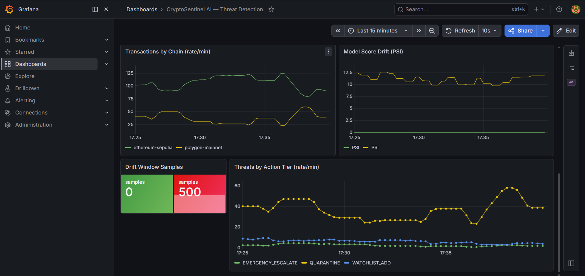
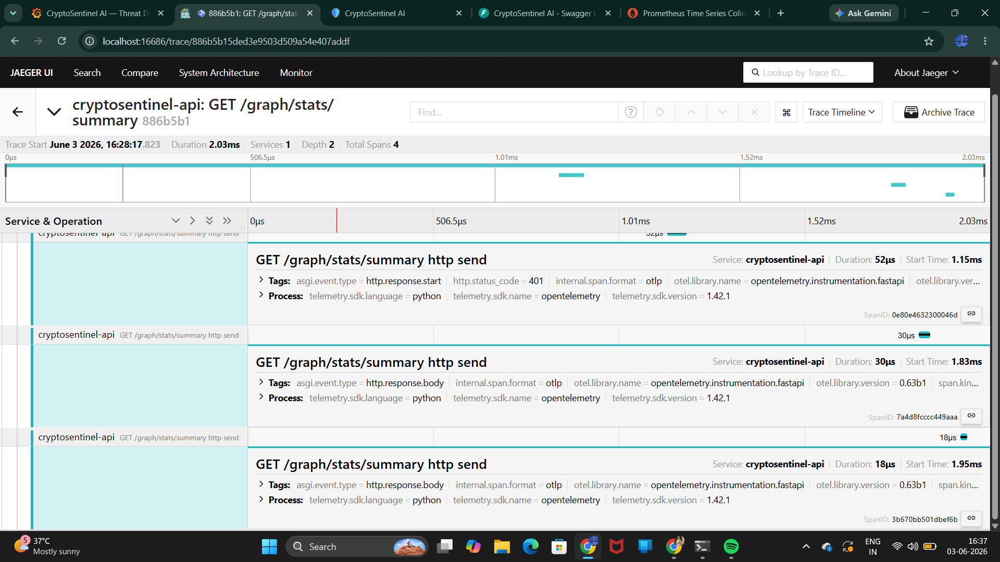
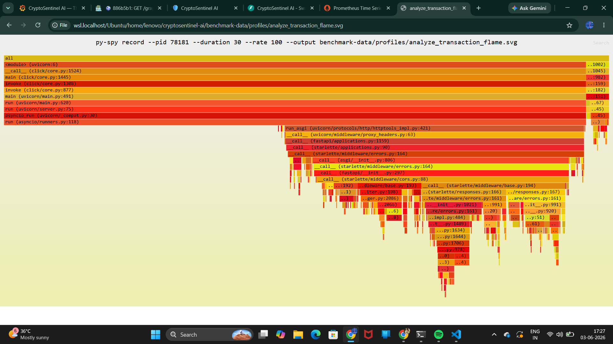
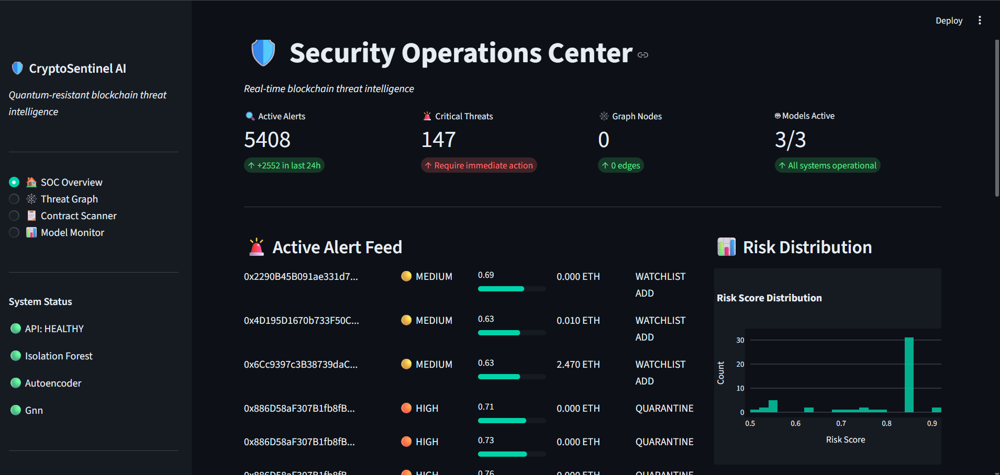
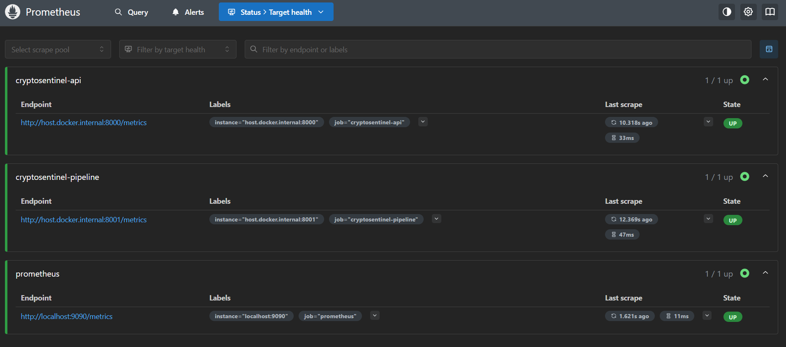
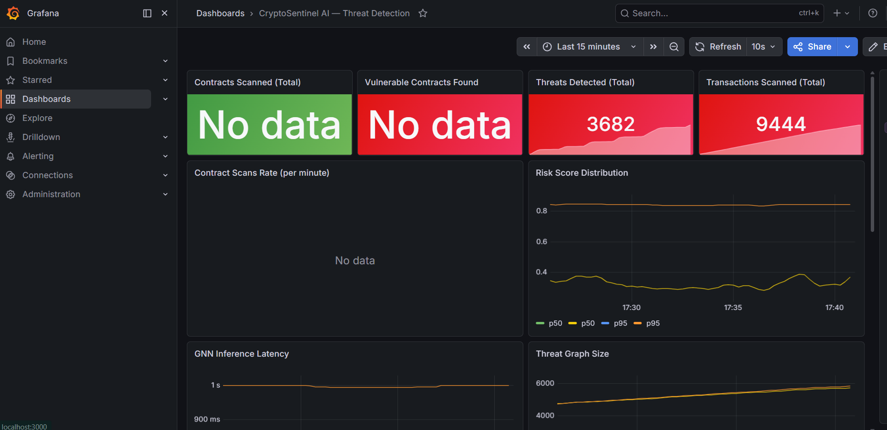

# 🛡️ CryptoSentinel AI

**Quantum-resistant blockchain threat intelligence platform** — detects money laundering and fraud on live multi-chain transactions using Graph Neural Networks, scans smart contracts for vulnerabilities, and signs threat alerts with post-quantum cryptography.

> All performance numbers below are **audited** — re-verified by re-running evaluation against the served model artifacts (see docs/BENCHMARKS.md), not copied from training logs.

## What it does

Monitors live **Ethereum (Sepolia)** and **Polygon (mainnet)** transactions concurrently, scores each for fraud/laundering risk through an ensemble + graph pipeline, escalates threats by action tier, and exposes everything through an authenticated API, a SOC dashboard, and a full metrics/traces/logs observability stack.

**Headline results (audited):**
- **GNN: F1 = 0.700, ROC-AUC = 0.902** on the Elliptic Bitcoin dataset — vs. Isolation Forest F1 ~ 0.001. Graph structure is the signal.
- **Live-native model: 5-fold CV F1 = 0.866** on the real 16-feature live space, trained with weak labels from OFAC sanctions + community darklists.
- **Post-quantum:** ML-DSA-65 signs 2.8x faster than ECDSA.

## Screenshots

### Grafana Dashboard

### Jaeger Distributed Trace

### Performance Profiling

### SOC Dashboard

### Prometheus Metrics

### Operations Monitoring

## Quick Start

Infrastructure, then API, pipeline, dashboard:

    cd docker && docker compose up -d && cd ..
    uvicorn src.api.main:app --host 0.0.0.0 --port 8000 &
    python -m src.pipeline.scoring_pipeline &
    python -m streamlit run src/dashboard/app.py

API: localhost:8000/docs - Dashboard: localhost:8501 - Grafana: localhost:3000 - Jaeger: localhost:16686

See docs/RUNBOOK.md for full operations. Allow 15-30s for the API to load models and become healthy.

## Architecture

    Ethereum Sepolia + Polygon mainnet
        -> BlockIngester (async, sampled) -> Kafka -> Feature Extraction
        -> Ensemble (IF + VAE + GNN + live-native model)
        -> ThreatGraph (NetworkX) -> Risk Scorer (composite, tiered)
        -> PQC-signed Alerts -> FastAPI (JWT/RBAC) behind Traefik gateway
        -> SOC Dashboard
    Observability: Prometheus (metrics) + Jaeger (traces) + Loki (logs),
    correlated by trace_id.

Full diagram: docs/ARCHITECTURE.md

## ML Results (audited - Elliptic Bitcoin dataset)

- Isolation Forest: F1 ~ 0.001 (weak baseline)
- VAE Autoencoder: F1 ~ 0.004 (weak baseline)
- GNN (GraphSAGE+GAT): F1 = 0.700, ROC-AUC = 0.902 (served checkpoint, re-verified)

Live-native model (16-feature live space): 5-fold CV F1 = 0.866 +/- 0.034, Test F1 = 0.877, ROC-AUC = 0.984.

Why two models? The Elliptic-trained GNN cannot score live EVM features (different feature space), so a live-native classifier handles live detection. See docs/MODELS.md.

## Key Features

- Multi-chain concurrent ingestion (async, per-chain sampling)
- Ensemble + GNN fraud detection; ThreatGraph laundering-path analysis
- Cross-chain bridge / multi-chain actor correlation
- Live-native ML trained on real on-chain behavior (weak supervision)
- PSI drift detection (baseline from the live scoring path)
- Post-quantum crypto (ML-DSA-65 / ML-KEM-768, NIST FIPS 203/204)
- Smart-contract scanner (rule + ML)
- Auth: RS256 JWT + RBAC on all routes, refresh + Redis JTI revocation
- API gateway (Traefik) with circuit breaker + graceful degradation
- Full observability: Prometheus + Jaeger + Loki, trace-log correlated
- Resilience: Kafka dead-letter buffer, fault-injection-verified degradation

## Tech Stack

Python 3.11, FastAPI, Web3.py, Kafka, PyTorch + PyTorch Geometric, NetworkX, scikit-learn, liboqs, Streamlit, Docker, Kubernetes, Prometheus, Grafana, Jaeger, Loki, Traefik, HashiCorp Vault, PostgreSQL.

## Documentation

- docs/ARCHITECTURE.md - system design
- docs/BENCHMARKS.md - audited metrics (single source of truth)
- docs/MODELS.md - model details + honest caveats
- docs/PERFORMANCE.md - profiling + optimization
- docs/RUNBOOK.md - operations
- SECURITY.md - security posture + accepted risks

## Tests

    make test         # fast suite (~40s)
    make test-full    # incl. slow SHAP tests
    make bench-check  # performance regression gate (local)

285 tests passing.

## Honest limitations

Tracked transparently (full list in BENCHMARKS.md / SECURITY.md): live-native model uses weak labels; CI runs a test subset (no 200MB dataset in repo); Polygon sampled at 20%; Elliptic models do not transfer to live features (which is why the live-native model exists). The benchmark gate is enforced locally and reported non-blocking in CI due to cross-machine noise.

## Run the demo locally

The full detection system — API + SOC dashboard + database — runs with one command (no Kafka/Vault/monitoring needed; scoring is on-demand):

    docker compose -f docker/docker-compose.demo.yml up

Then open:
- SOC dashboard: http://localhost:8501
- API docs (Swagger): http://localhost:8000/docs

Models are baked into the image; the database initializes automatically. First build takes a few minutes (PyTorch + dependencies). To stop and reset: `docker compose -f docker/docker-compose.demo.yml down -v`.

Note: post-quantum signing (liboqs) is omitted from the slimmed demo image for fast startup; the full PQC stack runs via the main `docker/docker-compose.yml`.
